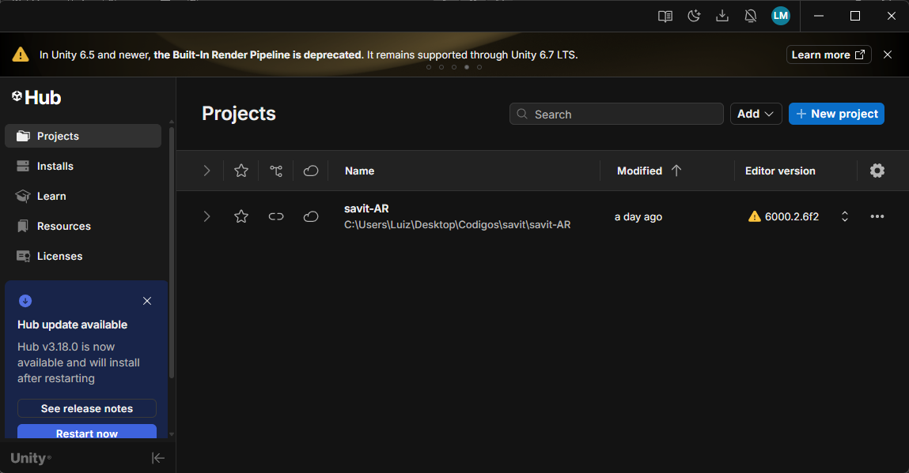
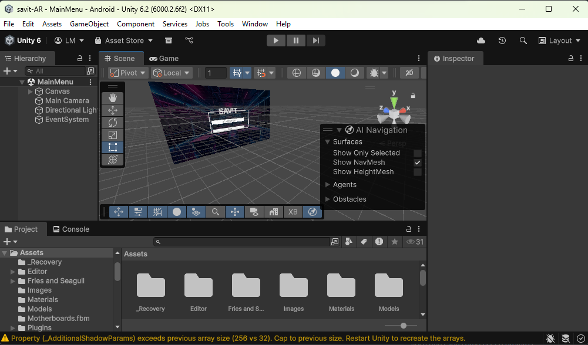
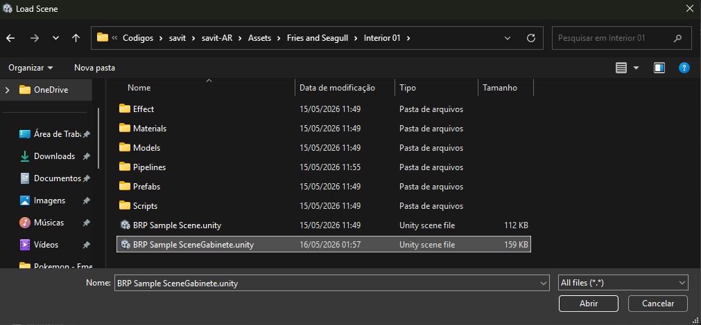
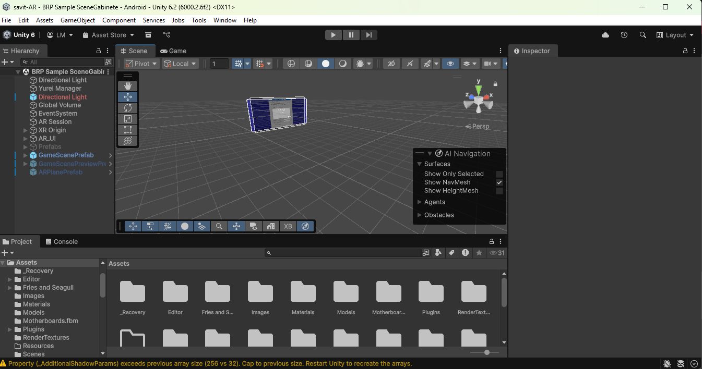
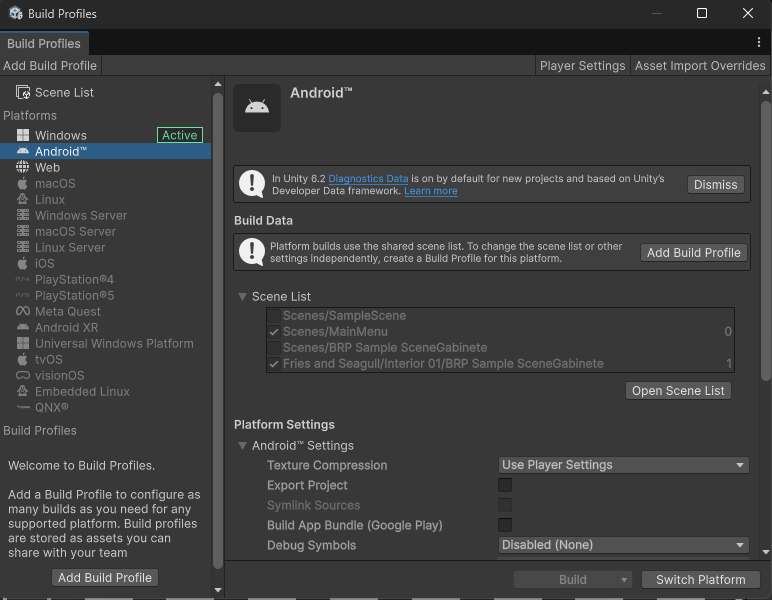

# PROJETO SAVIT

  

O Projeto SAVIT (Sistema de Aprendizado Virtual de Infraestrutura de T.I.) é um jogo que guia você no aprendizado de conteúdos sobre computadores, DVR, firewalls, UniFi, entre outros temas do universo de redes e infraestrutura.

## Demonstração

Assista a uma demonstração prática do projeto em funcionamento no vídeo abaixo:

## Como Utilizar
O software ainda está em desenvolvimento. Você pode:

- Baixar e instalar o APK (recomendado para testes rápidos).
- Rodar o projeto no Unity (modo de desenvolvimento).

### Baixar APK
O APK fica disponível nas Releases do GitHub:

- https://github.com/Orbi-SP/savit-AR/releases

### Rodar no Unity (modo de desenvolvimento)
Para executar no Unity, você precisará dos itens abaixo:

- **Unity Engine (Unity Hub)**: necessário para abrir e executar o projeto.
- **Internet**: o Unity vai baixar dependências via UPM (Unity Package Manager) na primeira abertura.
- **Git**: necessário para o UPM baixar o pacote do MediaPipe (dependência via Git).

Após clonar o repositório, você não precisa criar um projeto novo no Unity.

1) Abra o projeto diretamente no Unity Hub:
- No Unity Hub, clique em **Add** (Adicionar)
- Selecione a pasta raiz deste repositório (a pasta que contém `Assets/`, `Packages/` e `ProjectSettings/`)

2) O projeto inicia, primeiramente, na cena do menu.

- Para ir para a cena da gameplay do projeto, aperte CTRL+O, vá até a pasta `savit-AR\Assets\Fries and Seagull\Interior 01` e selecione `BRP Sample SceneGabinete.unity`.

3) Agora você estará na cena em que a gameplay acontece.

- Agora é necessário trocar o build para Android (caso ainda não esteja). Aperte CTRL+SHIFT+B, selecione Android e clique em **Switch Platform**.
- Se o módulo de Android não estiver instalado, o próprio Unity vai indicar como baixar/instalar.

4) Conecte o celular via USB no computador e deixe o aparelho com **Opções do Desenvolvedor** e **Depuração USB** ativadas.
- Depois, aperte CTRL+B para buildar.
- Siga as janelas do Unity e, no celular, aceite a instalação do APK.

Para acompanhar futuras atualizações, acesse nossa landing page: https://orbi-sp.github.io/landing-page/

MediaPipe utilizado (UPM/Git, tag v0.16.3): https://github.com/homuler/MediaPipeUnityPlugin.git?path=Packages/com.github.homuler.mediapipe#v0.16.3
Referência do pacote no repositório: https://github.com/homuler/MediaPipeUnityPlugin/tree/v0.16.3/Packages/com.github.homuler.mediapipe

Obs.: o Unity Package Manager não aceita URL direta para arquivos `.tgz`. Por isso o pacote é baixado via Git, e os binários necessários para Android/Protobuf ficam versionados em `Assets/Plugins/`.